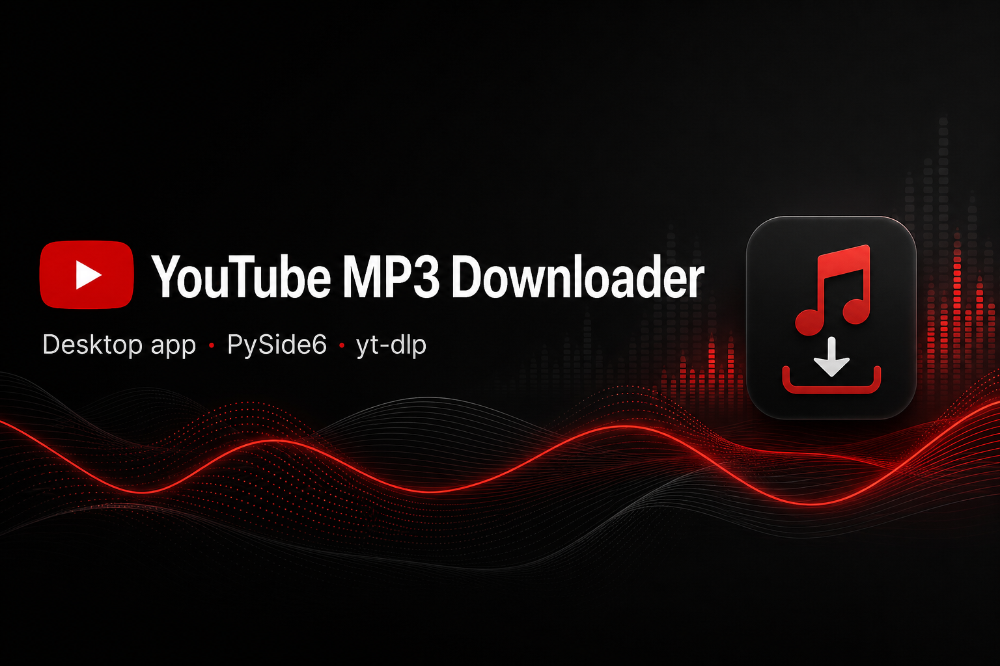
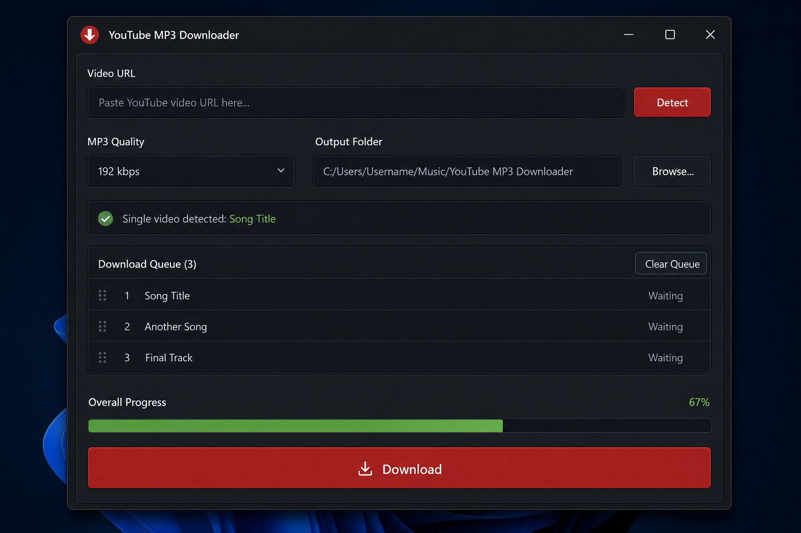
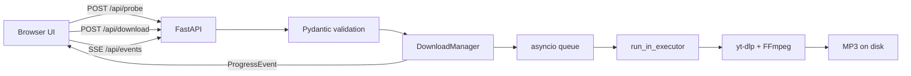

# YouTube MP3 Downloader

[](https://www.python.org/)
[](https://fastapi.tiangolo.com/)
[](https://docs.pydantic.dev/)
[](https://doc.qt.io/qtforpython/)
[](https://github.com/yt-dlp/yt-dlp)
[](LICENSE)

A local-first app that converts YouTube videos and playlists into tagged MP3 files. Ships with a **FastAPI web UI** (SSE live progress) and an optional **PySide6 desktop app**.

<p align="center">
  
</p>

<p align="center">
  
</p>

---

## Features

| Feature                  | Description                                              |
| ------------------------ | -------------------------------------------------------- |
| **Web + desktop UIs**    | Browser UI by default; native Qt app with `--desktop`    |
| **Real-time progress**   | Server-Sent Events stream download status to the browser |
| **Typed API**            | Pydantic v2 models validate every request and response   |
| **Playlist support**     | Detect playlists and pick which tracks to download       |
| **Quality control**      | Choose bitrate: 128, 192, 256, or 320 kbps               |
| **Async download queue** | asyncio worker pool; yt-dlp runs in thread executor      |
| **ID3 metadata**         | FFmpeg embeds tags via post-processing                   |

---

## Tech Stack

```
┌──────────────────────────────────────────────────┐
│   Web UI (HTML + Tailwind)  ·  PySide6 Desktop   │
├──────────────────────────────────────────────────┤
│              FastAPI + SSE (/api/events)          │
├──────────────────────────────────────────────────┤
│   Pydantic models  ·  asyncio DownloadManager    │
├──────────────────────────────────────────────────┤
│        core/playlist.py  ·  core/downloader.py    │
├──────────────────────────────────────────────────┤
│              yt-dlp + FFmpeg + mutagen            │
└──────────────────────────────────────────────────┘
```

| Layer       | Technology                                 | Role                                        |
| ----------- | ------------------------------------------ | ------------------------------------------- |
| Web API     | [FastAPI](https://fastapi.tiangolo.com/)   | REST endpoints + SSE progress stream        |
| Validation  | [Pydantic v2](https://docs.pydantic.dev/)  | Typed models for probe, download, events    |
| Concurrency | asyncio                                    | Non-blocking queue; sync yt-dlp in executor |
| Web UI      | Tailwind CSS                               | Dark-themed responsive interface            |
| Desktop     | PySide6                                    | Optional native GUI                         |
| Extraction  | [yt-dlp](https://github.com/yt-dlp/yt-dlp) | URL probing and audio download              |
| Transcoding | FFmpeg                                     | MP3 conversion and metadata embedding       |

---

## Project Structure

```
youtubeMusicDownloader/
├── api/
│   ├── main.py              # FastAPI app + SSE endpoint
│   └── static/              # Web UI (index.html, app.js)
├── app/
│   └── desktop.py           # PySide6 desktop window
├── core/
│   ├── models.py            # Pydantic request/response models
│   ├── config.py            # pydantic-settings configuration
│   ├── queue.py             # asyncio DownloadManager
│   ├── downloader.py        # yt-dlp + FFmpeg pipeline
│   └── playlist.py          # URL probing
├── ui/                      # Desktop-only styles & dialogs
├── assets/                  # Icons and README visuals
├── run.py                   # Entry point (web or --desktop)
├── tests/                   # pytest suite
├── pyproject.toml           # Modern Python packaging
└── requirements.txt
```

---

## Getting Started

### Prerequisites

- **Python 3.10+**
- **FFmpeg** on your `PATH`

<details>
<summary><strong>Install FFmpeg</strong></summary>

**Windows:**

```bash
winget install Gyan.FFmpeg
```

**macOS:**

```bash
brew install ffmpeg
```

**Linux:**

```bash
sudo apt update && sudo apt install ffmpeg
```

</details>

### Installation

```bash
git clone https://github.com/imsupeer/youtubeMusicDownloader.git
cd youtubeMusicDownloader

python -m venv .venv

# Windows
.venv\Scripts\activate

# macOS / Linux
source .venv/bin/activate

pip install -r requirements.txt
```

### Run

**Web UI** (default - opens browser at `http://127.0.0.1:8765`):

```bash
python run.py
```

**Desktop app:**

```bash
python run.py --desktop
```

**Options:**

```bash
python run.py --no-browser          # Web UI without auto-open
python run.py --port 9000           # Custom port
```

### Tests

```bash
pip install -r requirements-dev.txt
pytest
```

---

## API

| Method | Endpoint        | Description                     |
| ------ | --------------- | ------------------------------- |
| `GET`  | `/`             | Web UI                          |
| `GET`  | `/api/config`   | Default output dir and bitrates |
| `POST` | `/api/probe`    | Detect single video or playlist |
| `POST` | `/api/download` | Queue tracks for download       |
| `GET`  | `/api/events`   | SSE stream of progress events   |

Interactive docs: `http://127.0.0.1:8765/docs`

---

## How It Works



1. **`probe()`** classifies URLs via yt-dlp flat-extract (no download).
2. **Pydantic models** validate probe results, download requests, and SSE payloads.
3. **`DownloadManager`** queues tasks and broadcasts `ProgressEvent` objects to all SSE subscribers.
4. **yt-dlp** runs in a thread pool so the async event loop stays responsive.

---

## Design Decisions

- **FastAPI + SSE over WebSockets** - one-directional progress fits SSE; simpler than WS for this use case.
- **Pydantic everywhere** - shared models between API and core; automatic OpenAPI docs.
- **Dual UI, one core** - `core/` has no FastAPI or Qt imports; both interfaces reuse the same pipeline.
- **asyncio over raw threads (web)** - modern Python concurrency; desktop still uses Qt signals for compatibility.

---

## Limitations

- Requires FFmpeg installed separately (not bundled).
- YouTube's terms of service may restrict downloading; use responsibly.
- No download history, resume, or concurrent multi-file downloads yet.

---

## Troubleshooting

### `Please sign in` or `HTTP Error 403`

YouTube sometimes blocks anonymous requests. The app already mitigates this by:

- Using alternate YouTube player clients (`android`, `web`, `ios`)
- Enabling Node.js for yt-dlp's JavaScript runtime when `node` is on your `PATH`

If downloads still fail:

1. **Make sure Node.js is installed** - [nodejs.org](https://nodejs.org/) (you have it if `node --version` works in a terminal).
2. **Update yt-dlp** - `pip install -U yt-dlp`
3. **Use browser cookies** (optional) - if you're signed into YouTube in Chrome, set before starting the app:

```bash
# Windows PowerShell
$env:YTDLP_COOKIES_BROWSER = "chrome"
python run.py
```

Supported values: `chrome`, `edge`, `firefox`, `brave`, `opera`, `vivaldi`.

If cookie decryption fails on Windows (DPAPI error), close the browser completely and try again, or use a different browser profile.

---

## License

This project is licensed under the [MIT License](LICENSE).
